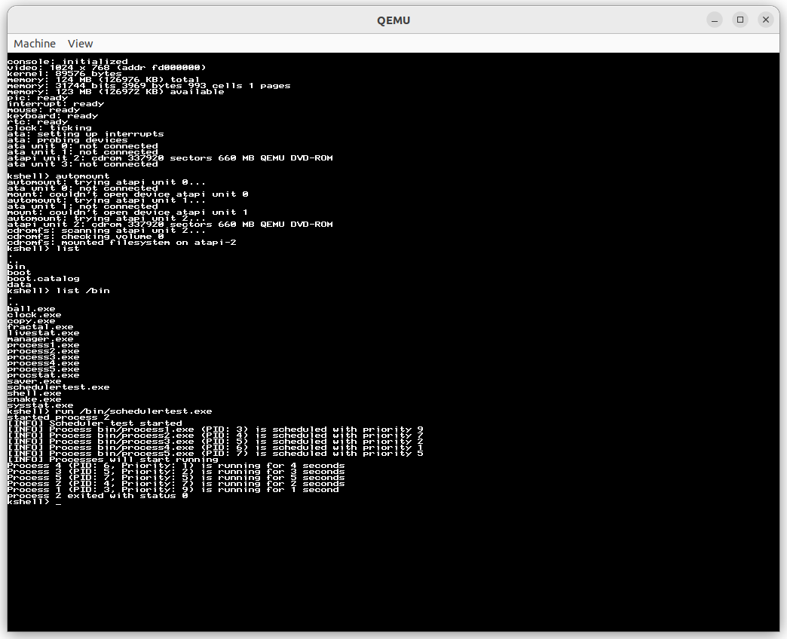
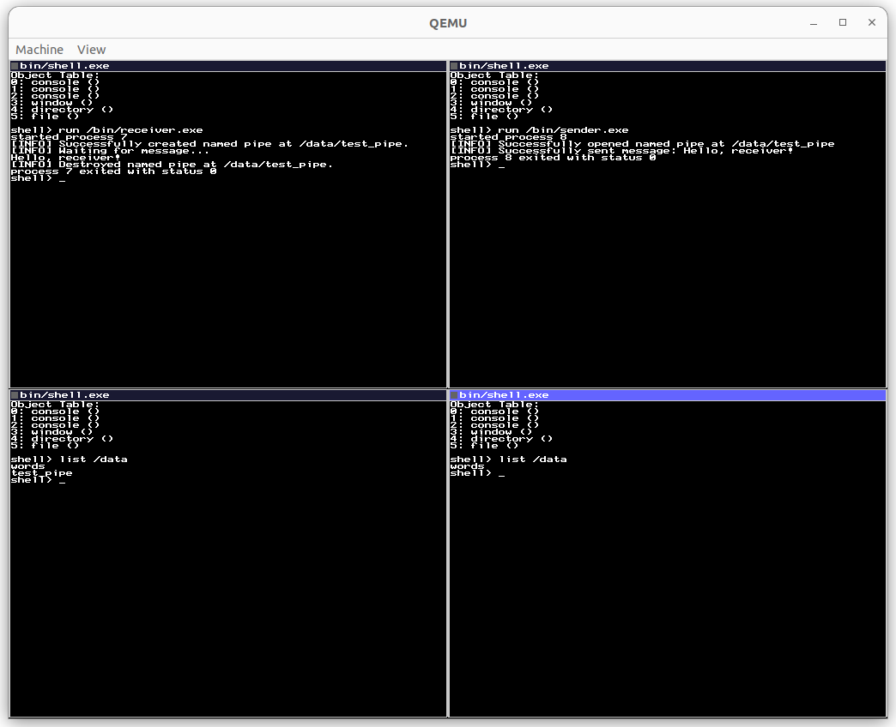

# The Basekernel Operating System Kernel

Course Project for CS3103 Operating Systems, Semester B 2023/24, City University of Hong Kong.

This project is an extension of the [Basekernel Operating System Kernel](https://github.com/dthain/basekernel). The extension includes two parts: priority-based scheduling and named pipe. Please visit our [Changelog](CHANGELOG.md) for more information on the changes.





To learn more about Basekernel, see the [Basekernel Wiki](https://github.com/dthain/basekernel/wiki).

## Usage

A cross-compiler is required to build the kernel.

```bash
$ ./build-cross-compiler.sh
$ export PATH="$PWD/cross/bin:$PATH"
$ make run
```

Alternatively, you can download the kernel image built by [this workflow](https://github.com/Soohti/CS3103-Project/actions/runs/8772196800).